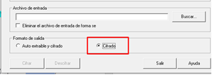

# AESCrypt
Instala la aplicación AESCrypt [aescrypt]. 
https://www.aescrypt.com/download/ 
Lee la documentación [aescrypt-doc].
Crea un documento de texto en el escritorio y encríptalo. Pásaselo con Formato de salida “Cifrado” (el que tiene extensión .aes) a un compañero dile la clave (no la transmitas por el mismo canal) y que lo desencripte. 
 
La clave por defecto está en hexadecimal. Para indicar una clave alfanumérica, desmarca la casilla señalada con una flecha:
 
