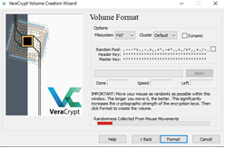

# Veracrypt
### 1.	Instala la aplicación Veracrypt [veracrypt] y lee el manual básico de [veracrypt-manual-basico]. A continuación
a.	Crea un volumen contenedor de archivos (encrypted file container) con las siguientes características:
i.	Standard VeraCrypt volumen
ii.	Ubicado en el escritorio
iii.	Encriptado con AES y con hash SHA-256
iv.	Capacidad 10MB 
v.	La aleatoriedad del algoritmo la darán los movimientos del ratón, como se observa en esta ventana. Mientras más movimientos de ratón, más fuerte es la clave de encriptación. En cualquier momento le puedes dar a “Format”
 
 

vi.	En la ventana final pulsa “Exit” y el archivo de la unidad encriptada, estará en tu escritorio.
b.	Móntalo en la unidad Y:
c.	Entra en “Mi PC” y confirma que la unidad nueva existe y que su tamaño es aproximadamente 10MB.
d.	Copia ficheros dentro de la unidad Y:
e.	Desmóntalo, pásaselo a un compañero a través del foro “EPD 8 - Criptografia 1” habilitado en el Campus Virtual y prueba a abrir el que él te haya pasado.

### 2.	Descarga el fichero 'volumen-veracrypt' adjunto a esta práctica. Es un volumen de 5MB con clave 'upo'. Móntalo en la unidad W: y abre la unidad. ¿Qué contiene?. 
Sube el pantallazo de la respuesta al DEBATE “Actividad no puntuable EPD8”
	
