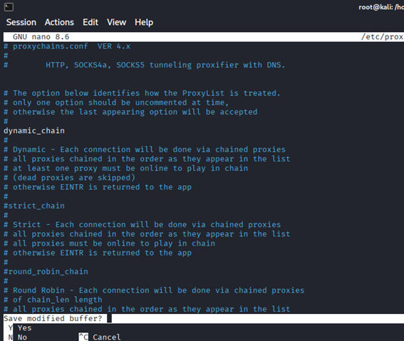
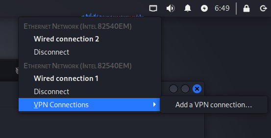
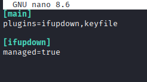

# ✅ Usos de Tor en hacking ético (permitidos y legales)
## 1. Proteger la identidad del auditor

En pruebas de penetración remotas (“external pentesting”), el auditor puede necesitar:

Navegar sitios objetivo sin exponer su IP real

Recolectar información (OSINT) sin dejar trazas

Evitar que el objetivo bloquee su IP personal o empresarial

Tor permite separar la identidad del auditor del entorno objetivo.

## 2. Evitar sesgos geográficos durante OSINT

Tor entrega IPs de distintos países, lo cual ayuda a:

Ver versiones diferentes de una web según la geolocalización

Detectar contenido oculto para ciertas regiones

Ver cómo un objetivo reacciona a usuarios internacionales

Esto es muy útil en reconocimiento pasivo.

## 3. Investigar amenazas en la Dark Web de forma segura

En ciberseguridad defensiva o forense, Tor sirve para:

Analizar foros de delincuentes

Observar la venta de datos filtrados

Ver si un cliente fue víctima de una brecha

Investigar botnets, leaks o malware compartido

Aquí se usa Tor como acceso seguro y aislado, no para participar en actividades ilegales.

## 4. Analizar comportamiento de malware

Algunos malwares usan Tor para:

Comunicarse con su C2

Exfiltrar datos

Recibir comandos

Un analista puede usar Tor para emular entornos controlados y estudiar cómo el malware se conecta, sin revelar su red real.

## 5. Evitar represalias durante auditorías delicadas

En entornos donde:

El cliente es altamente vigilado

El pentest puede ser detectado

La organización está en un país donde la ciberseguridad es sensible

El anonimato adicional reduce riesgos para el auditor.


## ⚠️ Lo que NO se debe hacer con Tor en hacking ético

Para mantenernos dentro de la ética real:

🚫 Lanzar ataques desde Tor
🚫 Hacer escaneos masivos a objetivos no autorizados
🚫 Evadir atribución en pruebas NO autorizadas
🚫 Configurar Tor para botnets o actividades maliciosas

El uso de Tor no convierte actos ilegales en legales.

## En resumen:

Tor se usa en hacking ético para:

✔ Mantener privacidad del auditor
✔ Recolectar información sin exponer IP
✔ Analizar amenazas de la Dark Web
✔ Investigar malware
✔ Evitar geobloqueos y sesgos


## Kali incluye un script oficial llamado torbrowser-launcher que facilita la instalación.

Comandos:
```bash
sudo apt update

sudo apt install torbrowser-launcher
```
Luego ejecuta:
``` torbrowser-launcher ```


El launcher:
Descargará la versión oficial desde torproject.org
Verificará su firma GPG
Instalará Tor Browser en tu usuario

Configurarlo:
nano /etc/proxychains4.conf 


❗ Consejo importante:

Si no necesitas enrutar todo el tráfico por Tor, lo más seguro es usar solo Tor Browser, porque está configurado para proteger tu anonimato.

# Ahora vamos a trabajar con VPN para securizar aún más nuestra identidad:



Entramos en 
```nano /etc/NetworkManager/NetworkManager.conf ```



es el archivo principal de configuración de NetworkManager en Linux (incluido Kali). Su función es controlar cómo se comporta NetworkManager, el servicio que gestiona:

Interfaces de red (eth0, wlan0, etc.)

Conexiones Wi-Fi

DHCP

VPNs

Direcciones IP

Rutas

Perfiles de red

### ✅ ¿Para qué sirve este archivo?

Permite activar, desactivar o modificar funciones globales de NetworkManager, como:

#### 1. Habilitar o deshabilitar managed para interfaces

Ejemplo típico:

[main]
plugins=ifupdown,keyfile

[ifupdown]
managed=true


Esto controla si NetworkManager gestiona o no las interfaces definidas en /etc/network/interfaces.

managed=true → NetworkManager controla todas las interfaces

managed=false → Las interfaces las controla el archivo /etc/network/interfaces

#### 2. Cambiar el comportamiento de DHCP

Ejemplo:

[main]
dhcp=internal


Puedes usar:

internal

dhclient

dhcpcd

#### 3. Control de permisos

Sirve para definir qué usuarios pueden administrar redes.

#### 4. Configurar ciertos plugins

Como:

keyfile

ifupdown

manejadores especiales para VPN

#### 5. Ajustes para redes específicas

Por ejemplo, evitar que NetworkManager modifique resolv.conf:

[main]
dns=none

## 🔍 ¿Por qué se usa en hacking o pentesting?

Durante auditorías, este archivo puede tocarse para:

✔ Evitar conflictos entre herramientas de red (airmon-ng, wifite, etc.)

✔ Evitar que NetworkManager reactive Wi-Fi automáticamente

✔ Deshabilitar administración automática sobre interfaces en modo monitor

✔ Configurar conexiones específicas manualmente